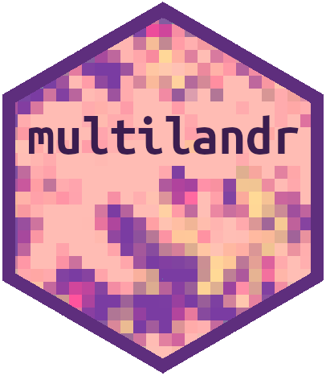
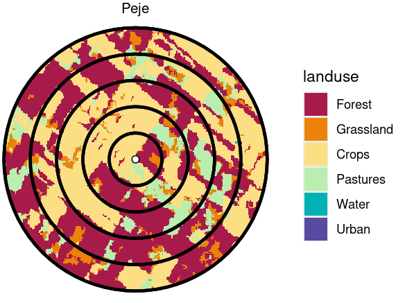

<!-- README.md is generated from README.Rmd. Please edit that file -->
<!-- # multilandr  -->

# multilandr

<!-- badges: start -->
<!-- badges: end -->

The goal of **multilandr** is to provide a clean platform for general
landscape-scale analysis. The package builds on several spatial-oriented
R packages to provide useful tools to develop and inspect landscapes at
multiple spatial scales. The main functionality allows to calculate
landscape metrics within a multi-scale approach. Among other practical
capabilities, the package provides several utility functions to: (i)
plot landscapes at different spatial scales; (ii) visualize correlations
between different metrics; (iii) filter landscapes that fulfill with
certain pre-defined conditions regarding their metric values; and (iv)
generate gradients for a given landscape metric.

**multilandr** supports several spatial objects from widespread
spatial-oriented R packages as main inputs in their functions, including
objects from packages **terra**, **raster**, and **sf**.

## Installation

You can install the development version of multilandr from
[GitHub](https://github.com/) with:

``` r
# install.packages("remotes")
remotes::install_github("phuais/multilandr")
```

You can access the manual with all available functions  
[here](https://github.com/phuais/multilandr/manual.pdf)

## Using multilandr: basic usage

A common landscape-scale study comprises the evaluation of a variable or
process (e.g. species richness or any ecological response) along a set
of landscapes varying in one or more attributes (e.g. the amount of
natural habitat). Usually, this evaluation is made through the
definition of several spatial-scales. Multi-scale landscapes can be
defined as concentric circular buffers around a central point (each of
the evaluated sites). There are plenty of examples for this experimental
design in the literature, such as De Camargo et al. (2018), Melo et al.,
(2017) or Verga et al. (2021).

**multilandr** provides tools to generate landscapes at different
spatial scales and calculate landscape metrics at each spatial scale.

### Generates ‘MultiLand’ object

We will first generate an object of class ‘MultiLand’. For this, we need
a vector of points depicting the location of the sites, around which
landscapes of different sizes will be generated (buffers).

``` r
library(multilandr)

# Loads points
elchaco_sites <- terra::vect(system.file("extdata", "elchaco_sites.gpkg", 
                                         package = "multilandr"))
```

We also need at least one raster layer. This will typically represent
different land covers within the extent of the vector layer of points.
In this example, the main raster layer comprises a land cover layer from
a clipped area of the Southamerican Chaco ecoregion for the year 2000
(Project MapBiomas Chaco, 2022). Other types of raster layers can be
inputted, such as relevant covariates. In this example, we also input a
raster layer containing the values of the Normalized Difference
Vegetation Index (NDVI) for the year 2000 (Landsat-7 image courtesy of
the U.S. Geological Survey) within the extent of analysis.

``` r
# Loads main raster of land covers
elchaco <- terra::rast(system.file("extdata", "elchaco.tif", 
                                   package = "multilandr"))
# Loads extra raster of NDVI values
elchaco_ndvi <- terra::rast(system.file("extdata", "elchaco_ndvi.tif", 
                                        package = "multilandr"))
```

We can define representative names for the land covers of the main
raster layer (here, a total of six):

``` r
cl_names <- c(1, "Forest",
              2, "Grassland",
              3, "Crops",
              4, "Pastures",
              5, "Water",
              6, "Urban")
```

We are now in conditions of generating a ‘MultiLand’ object with the
function `mland()`. We also need to specify the spatial scales to be
evaluated, through the argument `radii`. Here we define five increasing
scales, from 1000 m until 5000 m, by 1000 m steps.

``` r
# Creates 'MultiLand' object by loading points, the main raster and an extra raster.
ernesdesign <- mland(points_layer = elchaco_sites,
                     rast_layer = elchaco,
                     radii = seq(1000, 5000, 1000),
                     class_names = list(cl_names),
                     site_ref = "name",
                     ext_rast_layer = elchaco_ndvi,
                     rast_names = c("landcover", "NDVI"))
#> Loading layers
#> Generating buffers
#> Generating intersections
```

The argument `site_ref` receives a string with the name of the attribute
of the vector layer of points, that contains the information about the
identity of each point (i.e. the name of each site). We can also specify
a name for the raster layers in argument `rast_names`, which could be
useful in further analyses.

Let’s see the output for the generated object:

``` r
# Returns basic information about the object
ernesdesign
#> class             : MultiLand
#> On the fly        : FALSE 
#> Raster layers     : 1 
#>   n classes       : 6 
#> Ext. raster layers: 1 
#> n points          : 15 
#> Site reference    : "name"
#> Radii (m)         : 1000 2000 3000 4000 5000
```

Basic information about the object is provided, including the number of
main raster layers (and classes for each one), the number of extra
raster layers, the number of points and the evaluated spatial scales.
The object itself contains the vector layer of points, and the
intersections between the required spatial scales and the inputted
raster layers. These are circular buffers around each point. Further
exploration of the object can be made through `ernesdesign@`.

By default, when `mland()` generates an object of class ‘MultiLand’, it
generates the intersections between the buffers (defined by the
specified spatial scales) and the provided raster layers. However, this
might not be desirable when a great amount of points is being evaluated
(hundreds or thousands of sites), mainly due to memory issues.
Therefore, `mland()` can be ran with the argument `on_the_fly = TRUE`.
If this is the case, intersections will not be generated in this step,
and will be generated when needed by other functions of the package. For
more information, see the help page for the function, and the provided
example.

An object of class ‘MultiLand’ can be saved for further use in another R
session, through `mland_save()`. An object of this class can be loaded
in a fresh R session through `mland_load()`.

``` r
mland_save(ernesdesign)
```

### Landscape plotting

Multi-scale landscapes can be plotted through `mland_plot()`. Only those
landscapes generated by the intersections with one raster layer can be
plotted at one time. Here, we plot all the multi-scale landscapes around
the site `"Peje"` and, by default, the main raster layer containing the
land covers is plotted.

``` r
mland_plot(ernesdesign, points = "Peje", title = "sitename")
```



Visualizing spatial data in the R environment can be uncomfortable.
Multi-scale landscapes can be exported for further exploration in a GIS
software, through the function `mland_export_gis()`.

``` r
mland_export_gis(ernesdesign, dir = "ernesdesign")
```

### Calculation of metrics

Once generated the ‘MultiLand’ object, this will serve as the main
output for further functions, the most important being
`mland_metrics()`. This function calculates metrics for the generated
landscapes at each spatial scale. Landscape metrics are calculated
through the package `landscapemetrics` (Hesselbarth et al. 2019), and
the function accepts the same arguments as the functions of this
package: `level`, `metric`, `name`, `type` or `what`. A full description
of available metrics can be explored with `metrics_list()`, which simply
outputs the metrics available by `landscapemetrics`.

In this example, we are calculating the percentage of the landscape
(`"pland"`) and the edge density (`"ed"`) for each one of the land
covers of the main raster (`level = "class"`). In the argument
`absence_values`, one can define which value should have a given metric
when the class (land cover) is not present in the landscape. Here, it
makes sense that this value should be zero for the percentage of the
landscape for a given land cover, in the absence of this class. Note
that, if not defined, the value in the case of absence of the given land
cover will be `NA`.

Calculation of other non-typical landscape metrics can be calculated,
specially for those raster layers with continuous values. Here, we
calculate the mean value and a user-defined calculation for the NDVI
values, inside argument `ext_calc`. The `NDVI` indicates that
calculations must be performed for the first extra raster layer
contained within the ‘MultiLand’ object (in this example, the unique
one).

``` r
# User-defined function: quotient between mean and standard deviation
mean_sd <- function(x){ mean(x)/sd(x) }

# Calculation of metrics
ed_metrics <- mland_metrics(ernesdesign, 
                            level = "class", 
                            metric = c("pland", "ed"),
                            absence_values = list("pland" = 0),
                            ext_calc = list(c("NDVI", "mean"), c(1, "mean_sd")))
```

Basic information about the object can be explored by printing the
object:

``` r
# Returns basic information about the object
ed_metrics
#> class            : MultiLandMetrics
#> Number of layers : 1 
#> Number of classes: 6 
#> Number of points : 15 
#> Radii (m)        : 1000 2000 3000 4000 5000 
#> Metrics
#>   Landscape-level:  
#>   Class-level    : ed pland 
#>   Patch-level    :  
#> Extra calcs.     : mean
```

Function `mland_metrics` outputs an object of class ‘MultiLandMetrics’,
whose main object comprises a data frame with the value for each
required metric at each landscape and spatial scale.

``` r
head(ed_metrics@data)
#>   rasterlayer layer_name point_id      site radius level class classname
#> 1           1  landcover        1 Algarrobo   1000 class     1    Forest
#> 2           1  landcover        1 Algarrobo   1000 class     2 Grassland
#> 3           1  landcover        1 Algarrobo   1000 class     3     Crops
#> 4           1  landcover        1 Algarrobo   1000 class     4  Pastures
#> 5           1  landcover        1 Algarrobo   1000 class     5     Water
#> 6           1  landcover        1 Algarrobo   1000 class     6     Urban
#>   patch_id metric     value
#> 1       NA     ed 13.827023
#> 2       NA     ed  5.939124
#> 3       NA     ed 16.239792
#> 4       NA     ed  3.711952
#> 5       NA     ed        NA
#> 6       NA     ed        NA
```

Data frame with metric’s values can be binded with a data frame
containing a response variable of interest within the evaluated sites.
The function `metrics_bind()` fulfills this purpose, by generating a
wide-format data frame, with one column per metric and spatial scale.
For more information and examples, explore the help page of the
function.

## Further tools

**multilandr** provides several other utility functions, specially when
analyzing multi-scale landscapes comprising a hundreds or thousands of
points. Correlations between metrics can be calculated with
`metrics_corr()`, and pairwise plots can be visualized with
`metrics_plots()`. The value of a given landscape metric can be plotted
against increasing spatial scales (i.e. scalograms) with
`metrics_scalogram()`. Landscapes can be filtered according to
predefined values for given metrics with `metrics_filter()`. In
addition, the function `metrics_gradient()` generates an optimized
gradient of predefined size for the values of a given metric, given the
spectrum of landscapes with different metric values. This can be useful
to select those landscapes that would be evaluated in a more bounded
experimental design that could comprises, for instance, field sampling
of sites. Explore these functions and examples in the help pages.

## Citation

If you use **multilandr** for your research, use the following citation:

Huais, PY. (under review). multilandr: an R package for multi-scale
landscape analysis. Landscape Ecology.

## References

De Camargo, R. X., Boucher‐Lalonde, V., & Currie, D. J. (2018). At the
landscape level, birds respond strongly to habitat amount but weakly to
fragmentation. Diversity and Distributions, 24(5), 629-639.

Hesselbarth, M. H., Sciaini, M., With, K. A., Wiegand, K., & Nowosad, J.
(2019). landscapemetrics: an open‐source R tool to calculate landscape
metrics. Ecography, 42(10), 1648-1657.

Melo, G. L., Sponchiado, J., Cáceres, N. C., & Fahrig, L. (2017).
Testing the habitat amount hypothesis for South American small mammals.
Biological Conservation, 209, 304-314.

Project MapBiomas Chaco – Collection 4.0 of annual land cover and land
use maps, accessed during July 2022 through the following link:
<https://chaco.mapbiomas.org/>

Verga, E. G., Huais, P. Y., & Herrero, M. L. (2021). Population
responses of pest birds across a forest cover gradient in the Chaco
ecosystem. Forest Ecology and Management, 491, 119174.
